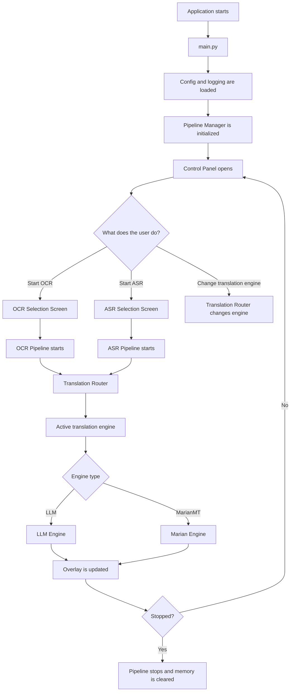
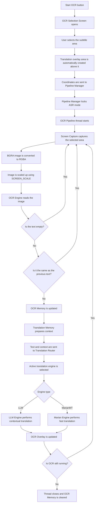
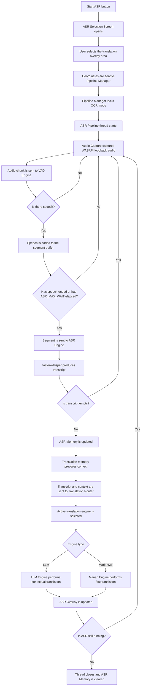
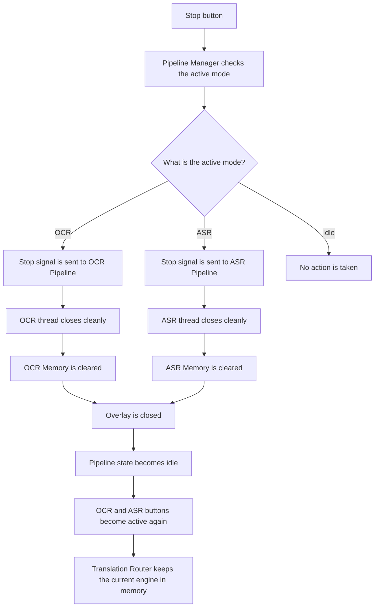
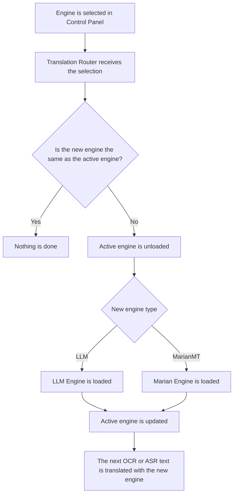

# Live Caption - System Pipeline Diagram

This document shows the Live Caption application workflow step by step.
The application has two main operating modes:

- OCR mode: Reads subtitle text from the screen, translates it, and displays it as an overlay.
- ASR mode: Listens to system audio, transcribes speech into text, translates it, and displays it as an overlay.

OCR and ASR cannot run at the same time. `pipeline_manager.py` decides which pipeline is allowed to run.

# General System Flow

# OCR Pipeline
OCR mode reads the subtitle area on the screen. The user selects only the subtitle area.
The translation overlay area is automatically created above the subtitle box.

# OCR Flow Summary
1. The user clicks the `START OCR` button.
2. `ocr_selection_screen.py` opens.
3. The user selects the subtitle area on the screen.
4. The selected area becomes the OCR reading area.
5. A second area with the same size is automatically created above it and becomes the translation overlay area.
6. `pipeline_manager.py` starts the OCR pipeline and locks the ASR button.
7. `screen_capture.py` captures the selected region with dxcam.
8. The image is converted to RGBA format and scaled up.
9. `ocr_engine.py` reads the text with Windows.Media.Ocr.
10. Empty or repeated text is skipped.
11. New text is added to memory.
12. Text and context are sent to `translation_router.py`.
13. The active translation engine translates the text into Turkish.
14. The result is displayed on screen through `ocr_overlay.py`.

# ASR Pipeline
ASR mode does not read text from the screen. It listens to system audio through WASAPI loopback.
The user only selects where the translation should appear on the screen.

# ASR Flow Summary
1. The user clicks the `START ASR` button.
2. `asr_selection_screen.py` opens.
3. The user selects the location of the translation overlay area.
4. `pipeline_manager.py` starts the ASR pipeline and locks the OCR button.
5. `audio_capture.py` captures system audio through WASAPI loopback.
6. Audio chunks are sent to `vad_engine.py`.
7. If there is no speech, the chunk is skipped.
8. If there is speech, it is added to the segment buffer.
9. When speech ends or `ASR_MAX_WAIT` elapses, the segment is sent to Whisper.
10. `asr_engine.py` produces a transcript with faster-whisper.
11. Empty transcripts are skipped.
12. The transcript is added to `asr_memory.py`.
13. Transcript and context are sent to `translation_router.py`.
14. The active translation engine translates the text into Turkish.
15. The result is displayed on screen through `asr_overlay.py`.

# Stop Flow
The `STOP` button cleanly shuts down the active pipeline.
The application does not close; only the running OCR or ASR flow stops.

# Stop Rules
- A stop signal is sent to the active pipeline.
- The thread closes cleanly.
- The active pipeline's memory is cleared.
- The overlay is closed.
- The application returns to the `idle` state.
- OCR and ASR buttons become usable again.
- The translation engine may remain in memory, so the model does not need to reload on the next start.

# Translation Engine Flow
The translation engine can be changed from the control panel.
This change does not require restarting the OCR or ASR pipeline.

# Translation Rules
- `translation_router.py` knows the active engine.
- OCR and ASR pipelines do not know which engine is selected.
- The pipeline only calls `translate(text, context)`.
- If an LLM is selected, contextual translation is used.
- If MarianMT is selected, faster and less contextual translation is used.
- When the engine changes, the old engine is unloaded from memory.
- Only one LLM is kept in VRAM at the same time.

# General Pipeline Rules
- OCR and ASR cannot run at the same time.
- The UI does not make decisions; it only sends signals.
- `pipeline_manager.py` handles start, stop, locking, and state decisions.
- In OCR mode, the user selects the subtitle area; the translation overlay area is created automatically.
- In ASR mode, the user selects only the translation overlay area.
- OCR and ASR use their own memory files.
- Translation Router does not know whether the text came from OCR or ASR.
- Overlay settings are updated instantly without restarting the pipeline.
- If a pipeline error occurs, the application does not fully close; the error is logged and the flow continues if possible.
- When stopped, the active memory is cleared, but the translation engine may remain in memory.
